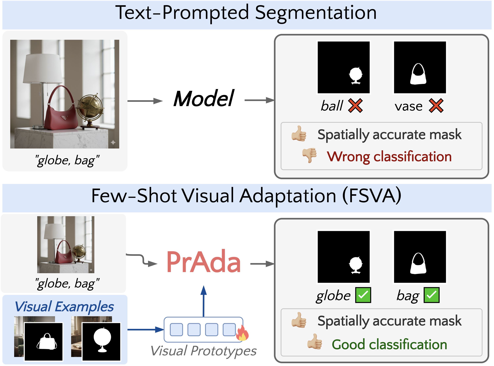

# PrAda: Few-Shot Visual Adaptation for Text-Prompted Segmentation

<p align="center">
  <a href="https://arxiv.org/abs/2605.19623"></a>
  <a href="https://cvpr.thecvf.com/"></a>
</p>

<p align="center"><strong>CVPR 2026 Findings</strong></p>

<p align="center">
  <a href="https://scholar.google.com/citations?user=8AfX1GcAAAAJ">Gabriele Rosi</a><sup>1,2</sup> &nbsp;·&nbsp;
  <a href="https://scholar.google.it/citations?hl=it&user=-fEOFbMAAAAJ">Fabio Cermelli</a><sup>2</sup> &nbsp;·&nbsp;
  <a href="https://scholar.google.com/citations?user=cM3Iz_4AAAAJ">Carlo Masone</a><sup>1,2</sup> &nbsp;·&nbsp;
  <a href="https://scholar.google.com/citations?user=mHbdIAwAAAAJ">Barbara Caputo</a><sup>1,2</sup>
</p>

<p align="center">
  <sup>1</sup> Politecnico di Torino &nbsp;&nbsp;
  <sup>2</sup> Focoos AI
</p>

---

<p align="center">
  
</p>

**PrAda** adapts frozen text-prompted segmentation models to new domains using just a few labeled examples.

- 🔍 **Root-cause analysis:** we study open-vocabulary segmentation under domain shift and find that **misclassification**, not mask quality, is the dominant failure mode
- 🧩 **Rich prototypes:** class-specific visual prototypes capture complementary spatial and semantic information, enabling effective adaptation from just a few examples
- ⚡ **Lightweight adaptation:** only the prototypes and a single importance scalar are learned, adding as little as **+0.02% parameters** while keeping the full model frozen
- 📈 **Strong performance:** consistent improvements over state-of-the-art across semantic, instance, and panoptic segmentation on **5 benchmarks (28 datasets)**
- ♾️ **Zero-shot preserved:** fusing visual and text scores at inference means the model retains its original open-vocabulary capability out of the box

---

## Code

> **Code will be released very soon.** Stay tuned!

---

## Citation

If you find this work useful, please consider citing:

```bibtex
@inproceedings{rosi2026prada,
  title     = {PrAda: Few-Shot Visual Adaptation for Text-Prompted Segmentation},
  author    = {Rosi, Gabriele and Cermelli, Fabio and Masone, Carlo and Caputo, Barbara},
  booktitle = {Proceedings of the IEEE/CVF Conference on Computer Vision and Pattern Recognition (CVPR) Findings},
  year      = {2026}
}
```

---

## Acknowledgements

The code is largely based on [FC-CLIP](https://github.com/bytedance/fc-clip) whom we thank for their excellent work.
